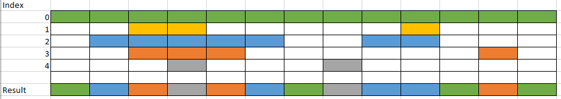

# Weighted interval merge

This library offers a default interval merge along with the ability to add a weight to each interval which will be used to resolve overlaps. If no weight is given or all weights are the same it will produce a standard interval merge, going from left to right.

The operation makes a copy of the input array, the original array and it's elements are unaltered. Any extra properties are preserved on the copy.



The method expects an input array with elements matching the following signature, only start and end properties are required. offsetStart and index default to 0.

Indexes are normalized back to 1, so three intervals with indexes 3, 5 and 10 will be normalized to 1, 2, 3.

## Installation

```sh
  npm install --save weighted-interval-merge
```

## Code example

```js
import { weightedIntervalMerge } from "weighted-interval-merge";

const intervals = [
  { id: 1, start: 0, offsetStart: 1, end: 10, index: 0 },
  { id: 2, start: 2, end: 7, index: 1 },
  { id: 3, start: 4, end: 5, index: 2 }
];

const merged = weightedIntervalMerge(intervals);
console.log(merged);

// [
//   { id: 1, start: 0, offsetStart: 1, end: 2, index: 1 },
//   { id: 2, start: 2, end: 4, index: 2, offsetStart: 0 },
//   { id: 3, start: 4, end: 5, index: 3, offsetStart: 0 },
//   { id: 2, start: 2, end: 7, index: 2, offsetStart: 3 },
//   { id: 1, start: 0, offsetStart: 7, end: 10, index: 1 }
// ];
```
